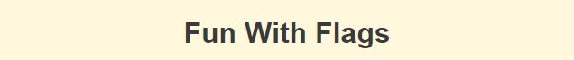
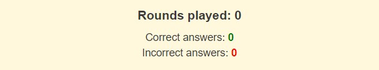

# Fun With Flags
The game is inspired by the popular sitcom series, The Big Bang Theory, in which Sheldom Cooper presents 'Fun With Flags'.

Fun With Flags is a site that uses vanilla JavaScript to educate users on which country the corresponding flags belong to. The site is targeted at users who like to test their country flag knowledge. The game is appropriate for all ages.
  

 

## Contents

[Features](https://github.com/lewis-worsley/digital-media-agency/blob/main/README.md#features)

[Testing](https://github.com/lewis-worsley/digital-media-agency/blob/main/README.md#testing)

[Deployment](https://github.com/lewis-worsley/digital-media-agency/blob/main/README.md#deployment)

[Languages](https://github.com/lewis-worsley/digital-media-agency/blob/main/README.md#languages)

[Software](https://github.com/lewis-worsley/digital-media-agency/blob/main/README.md#software)

[Media](https://github.com/lewis-worsley/digital-media-agency/blob/main/README.md#media)

[Credits](https://github.com/lewis-worsley/digital-media-agency/blob/main/README.md#credits)

 

## Features

All of the contents and features is hosted on one page.

### Existing Features

To evaluate the website, the structure can be split into four sections:

#### Heading

- Featured at the top of the page, the heading is clean to read and simple for users to digest. The heading is to encourage users to have fun.

 

 

#### Flag Image Area

- The user is presented with an image of a country's flag. The image is randomly generated by the computer and cannot be changed.

 

 

#### Question Area

- The user is presented with three options. One of the options is correct. The user can either click one of the buttons or press 1 (connected to the left button), 2 (middle), or 3 (right). This means the user does not need to use a mouse to play the game.
- If the user guesses correctly, the background color of the box will change to green for 1.5 seconds before returning to its default state ready for the next round.
- If the user guesses wrongly, a pop-up will make it known to the user and inform him/her of the correct answer. The background color of the box will change to red for 1.5 seconds before returning to its default state ready for the next round.

 

 

#### Score Area

- Under the buttons, the user can stay informed about how many rounds they've played and their score. 

 

 

Noted for future development:

- To include all 197 countries via an API

## Testing

Google Dev-tools was used for responsive design; to validate JavaScript concepts; run console.log; and use debugger and breakpoints to discover how the function was perfoming and where there were errors.

 

### Am I Responsive

To check to see if the game was responsive across different types of devices, the URL was entered into https://ui.dev/amiresponsive/. The game appeared as expected across each device. The image snippet in the intro section of this README.md is provided by https://ui.dev/amiresponsive/

 

### Testing on devices

During development of the game, the code was written and tested on HP EliteBook 840 G5 14". 

Google Dev-tools was used throughout the process, as it provides feedback on HTML, CSS, & JS.

After development, the website has been tested on the following devices:

- HP EliteBook 840 G5 14" - Chrome and Microsoft Edge
- LG 21.5" monitor 
- iPhone XS Max - Chrome and Safari

<strong>HP EliteBook 840 G5 14" - using Google Device Toolbar</strong> 

 
 
<strong>iPhone XS Max</strong> 

 

Noted for future development:

- On hover, the navbar button performs as expected, but there is a tiny zone where it transforms, however it does not change color as expected. It's not a major issue, other than a tiny annoyance
- On iPhone XS Max, Safari, the header colour doesn't cover all of the top, there is a small bit of white spacing left exposed
- On mobile, when scrolling back to the top, because of the 'bounce' effect, some of the background image is exposed without a black transparent layer over it
- On iPhone XS Max, Safari, it appears the submission button adopts a different style to the default one which is seen on desktop

 

### Validator Testing

The three websites used to validate the code are:

- https://validator.w3.org/
- https://jigsaw.w3.org/css-validator/

For accessibility, the following websites and extensions were used:

- WCAG Contrast Checker
- Lighthouse

 

#### HTML Validator

Errors discovered: 

 

 

Additional error discovered after integrating the hamburger menu onto the navbar:
 

 

Errors fixed: 

 

- Whilst the errors - including the additional error regarding the hamburger menu - were able to be fixed, the warning still remains. In this instance, the quote section does not need no heading elements due to no hierarchy of importance. It is a standalone section which conveys only one message: the Founder's thoughts.

 

#### CSS Validator
Website used to validate CSS code: https://jigsaw.w3.org/css-validator/

Errors discovered: 

Errors fixed: 
 

- The latest version of the CSS stylesheet reported no errors

 

#### WCAG Contrast Checker

 
It's reported that there are four contrasting errors:

- Two of the errors are located in the services section regarding Social Media Marketing. However, the image provided below show there is no visibility issue  and reading difficulty as there is a contrast between foreground and background colour

 

- The other two are located in the form section. The h2 and p element have a white foreground colour against a gradient background. The example below shows there are no issues with visibility 

 

 

#### Lighthouse

Lighthouse has reported extemely positive metrics (see graphic below) with scores ranging from 90 to 100. The results are:

- Performance: 100
- Accessibility: 97
- Best practises: 100
- SEO: 90

 
 

## Deployment

The site was deployed to GitHub pages. The steps to deploy are as follows:

- In the GitHub repository, navigate to the Settings tab
- From the source section drop-down menu, select the Main Branch
- Once the master branch has been selected, the page will be automatically refreshed with the word 'active' displayed in a green colour at the end of the sentence (next to last duration when published)
The live link can be found here - https://lewis-worsley.github.io/digital-media-agency/

 

## Languages

The coding languages used:

- HTML
- CSS

 

## Software

The design for RISE Media was created via the Adobe Creative Cloud Suite; more specifically I used:

- Abobe Photoshop
- Adobe InDesign
- Adobe Illustrator

Through using these three tools, I was able to design the logo, create imagery, design the website, and compress web images by either reducing image size or quality via export.

 

## Media

The logo and icons for RISE Media was designed by myself, Lewis Worsley.
  

The background hero image of the office was found and saved via search on Google Images: https://www.linkedin.com/company/goodstuff-communications/. The original company logo was removed and replaced with the RISE Media logo via Adobe Photoshop.

 

## Credits

To help bring this project to life, the following deserve recognition:

 

### Content

The CSS code to transform the navbar button on hover was provided by https://developer.mozilla.org/en-US/docs/Web/CSS/transform-function/translateY

- The CSS code to integrate the hamburger menu onto the navbar was provided by https://alvarotrigo.com/blog/hamburger-menu-css/#:~:text=What%20Is%20A%20Hamburger%20Menu,top%20of%20the%20main%20content > 1 Responsive CSS Hamburger Menu - CSS only

- The 3-colour-gradient for the brand was provided by https://mycolor.space/

- The CSS structure for the hero section was inspired by the Code Institute's Coders Coffeehouse

- The CSS code to achieve a gradient background was provided by https://www.w3schools.com/

- To specify a minimum font-size for responsive design - especially for mobile - a user from Stack Overflow in a public open forum https://stackoverflow.com/questions/23984629/how-to-set-min-font-size-in-css provided CSS code to help achieve this

- Change the color of the placeholder text of an input field was provided by https://www.w3schools.com/

- Font pairing (Proza Libre and Open Sans) for RISE Media was inspired by https://www.fontpair.co/

- Social media text icons located in the footer were sourced from https://fontawesome.com/

 

### Thanks

- Richard Wells
    - His mentorship and time have been of utmost value to me progressing this project along. I showed my concept of RISE Media to Richard on our first call and he gave me the encouragement and belief that I could execute the design. His easy-going and laid-back persona reminds me of myself, which is why I feel our meetings have been valuable and fun. 