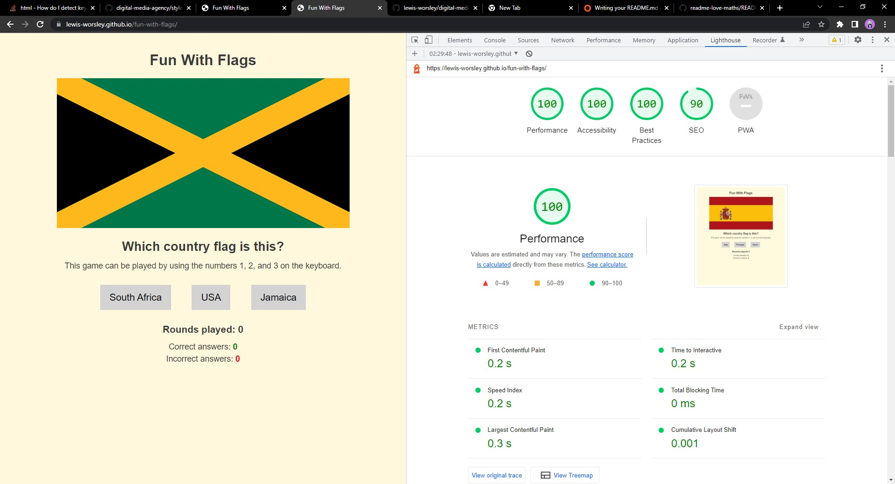

# Fun With Flags
The game is inspired by the popular sitcom series, The Big Bang Theory, in which Sheldom Cooper presents 'Fun With Flags'.

Fun With Flags is a site that uses vanilla JavaScript to educate users on which country the corresponding flags belong to. The site is targeted at users who like to test their country flag knowledge. The game is appropriate for all ages.
  

 

## Contents

[Features](https://github.com/lewis-worsley/fun-with-flags/blob/main/README.md#features)

[Testing](https://github.com/lewis-worsley/fun-with-flags/blob/main/README.md#testing)

[Deployment](https://github.com/lewis-worsley/fun-with-flags/blob/main/README.md#deployment)

[Languages](https://github.com/lewis-worsley/fun-with-flags/blob/main/README.md#languages)

[Software](https://github.com/lewis-worsley/fun-with-flags/blob/main/README.md#software)

[Media](https://github.com/lewis-worsley/fun-with-flags/blob/main/README.md#media)

[Credits](https://github.com/lewis-worsley/fun-with-flags/blob/main/README.md#credits)

 

## Features

All of the contents and features is hosted on one page.

### Existing Features

To evaluate the website, the structure can be split into four sections:

#### Heading

- Featured at the top of the page, the heading is clean to read and simple for users to digest. The heading is to encourage users to have fun.

 

 

#### Flag Image Area

- The user is presented with an image of a country's flag. The image is randomly generated by the computer and cannot be changed.

 

 

#### Question Area

- The user is presented with three options. One of the options is correct. The user can either click one of the buttons or press 1 (connected to the left button), 2 (middle), or 3 (right). This means the user does not need to use a mouse to play the game.
- If the user guesses correctly, the background color of the box will change to green for 1.5 seconds before returning to its default state ready for the next round.
- If the user guesses wrongly, a pop-up will make it known to the user and inform him/her of the correct answer. The background color of the box will change to red for 0.5 seconds before returning to its default state ready for the next round.
- The text underneath the heading is hidden when media screen is 719px and less because it's likely they will be using touchscreen to play the game on mobile or tablet.

 

 

#### Score Area

- Under the buttons, the user can stay informed about how many rounds they've played and their score. 

 

 

Noted for future development:

- To include all 197 countries via an API
- Ensure no flag is repeated twice in a row

## Testing

Google Dev-tools was used for responsive design; to validate JavaScript concepts; run console.log; and use debugger and breakpoints to discover how the function was perfoming and where there were errors.

 

### Bugs

UPDATE: It was discovered there was a bug in the gameplay, where the user was able to click same answer multiple times before the next round began. This has since been resolved. Also, to improve gameplay and UX, I incorporated SweetAlert2 (https://sweetalert2.github.io/) into my project to replace the traditional JavaScript popup boxes.

Correct answer with SweetAlert2

 

Wrong answer with SweetAlert2

 

 

### Am I Responsive

To check to see if the game was responsive across different types of devices, the URL was entered into https://ui.dev/amiresponsive/. The game appeared as expected across each device. The image snippet in the intro section of this README.md is provided by https://ui.dev/amiresponsive/

 

### Testing on devices

During development of the game, the code was written and tested on HP EliteBook 840 G5 14". 

Google Dev-tools was used throughout the process, as it provides feedback on HTML, CSS, & JS.

After development, the website has been tested on the following devices:

- HP EliteBook 840 G5 14" - Chrome and Microsoft Edge
- LG 21.5" monitor 
- iPhone XS Max - Chrome and Safari

<strong>HP EliteBook 840 G5 14" - using Google Device Toolbar</strong> 
 
 
 
<strong>iPhone XS Max</strong> 
 
 

### Validator Testing

The three websites used to validate the code are:

- https://validator.w3.org/
- https://jigsaw.w3.org/css-validator/
- https://jshint.com/

For accessibility, the following websites and extensions were used:

- Lighthouse

 

#### HTML Validator

Errors discovered: 
 

 

- Two errors have been discovered: no src or alt attributes included in the img tag. The reason why these two attributes weren't included, because they're updated through a function in the JS file which pulls information from the objects in the Flags array to populate the src and alt attributes. For example, see screenshot below.

 

- However, to remove the errors, I've included both src and alt attributes to the img tag. Now, no errors are reported.

 

 

#### CSS Validator

No errors were reported.

 

#### JS Validator

Warnings were reported, but despite this, the game performs as expected.

 

 

#### Lighthouse

Lighthouse has reported extemely positive metrics (see graphic below) with scores ranging from 90 to 100. The results are:

- Performance: 100
- Accessibility: 100
- Best practises: 100
- SEO: 90

 
 

## Deployment

The site was deployed to GitHub pages. The steps to deploy are as follows:

- In the GitHub repository, navigate to the Settings tab
- From the source section drop-down menu, select the Main Branch
- Once the master branch has been selected, the page will be automatically refreshed with the word 'active' displayed in a green colour at the end of the sentence (next to last duration when published)
The live link can be found here - https://lewis-worsley.github.io/fun-with-flags/

 

## Languages

The coding languages used:

- HTML
- CSS
- JavaScript

 

## Software

The images were resized to the same ratio in Adobe Photoshop.

 

## Media

The country flags were sourced from Google images.

 

## Credits

To help bring this project to life, the following deserve recognition:

 

### Content

- The JS code to detect keypresses (1, 2, and 3) https://stackoverflow.com/questions/16089421/how-do-i-detect-keypresses-in-javascript

- The JS code to add a waiting time between rounds in the game https://www.w3schools.com/jsref/met_win_settimeout.asp

- The JS code to increment player scores was inspired by the Code Institute's Love Maths game.

 

### Thanks

- Dominic Paul (friend)
    - His support and feedback was helpful because I was able to understand my mistakes so that I could correct them and build the game I had envisioned.